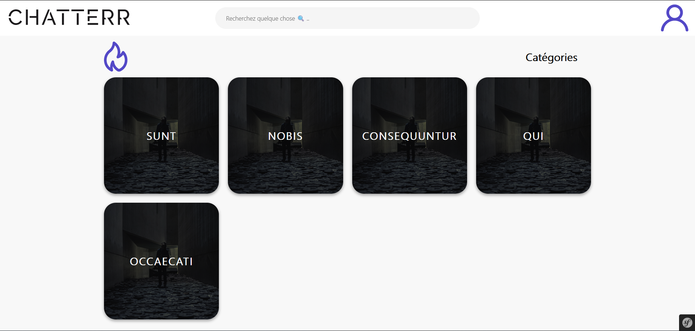
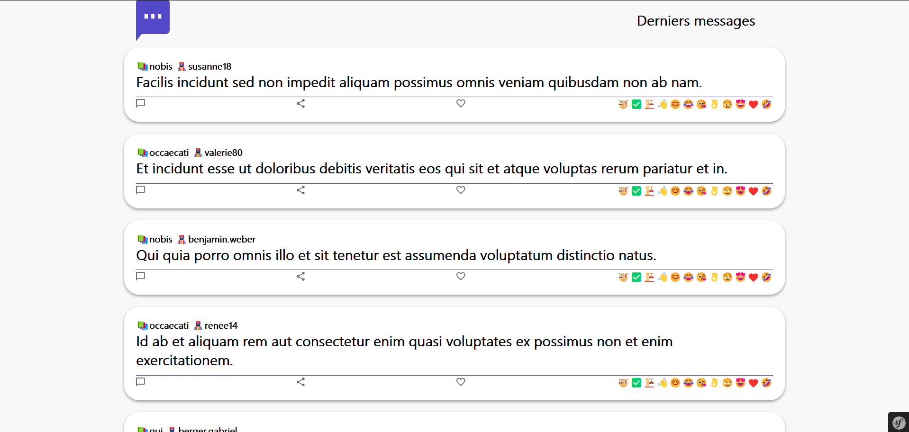
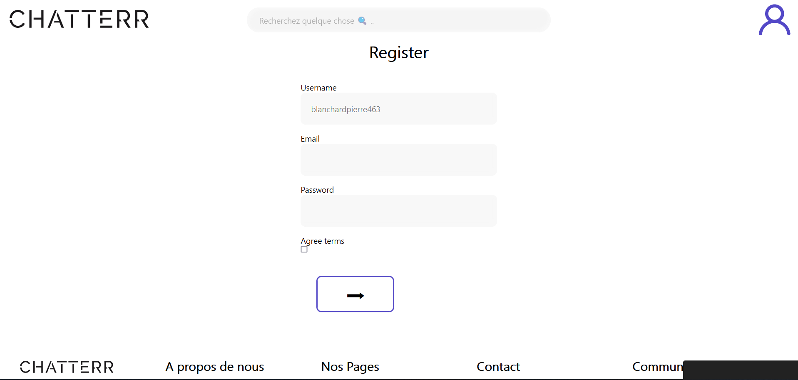
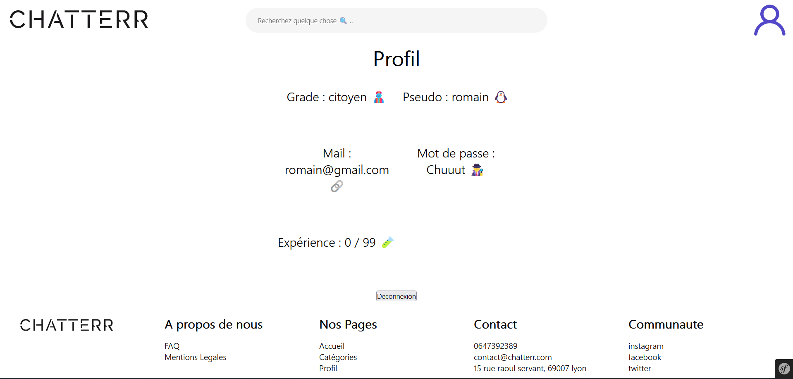
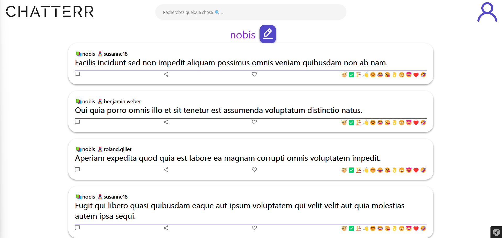
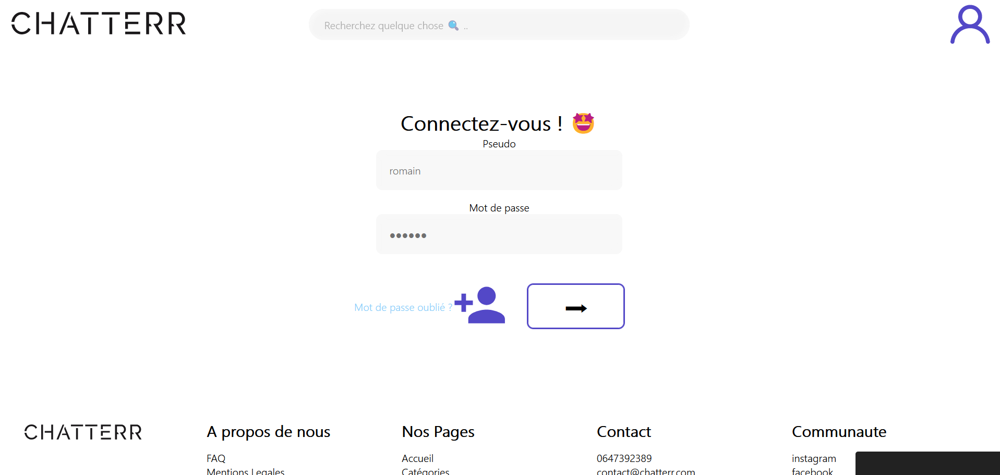
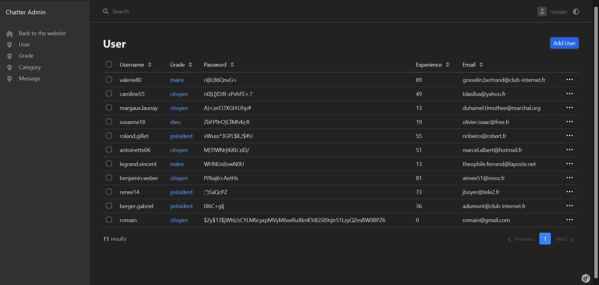

# Chatterr

[](https://symfony.com/)
[](https://php.net/)
[](http://www.gnu.org/licenses/agpl-3.0)


A reddit like website, where people can create subjects and send messages inside

Users can earn experience when they create a subject or send a message they earn experience

Users earn 1 point of experience for every message they send and 5 points of experience for every category they create

Users can sign up and sign in to the website

Users can edit their personal information

Users can recover their password via an email 

Administrators have access to a back office 

Usernames are suggested with an [API](https://rapidapi.com/mrsonj/api/random-username-generate/) when the user creates an account
________________________________________________


### Roadmap

- Users can react with their own emojis 🦧

- Personal profil picture

- Users can comment the messages

- Users can comment the comments

- Create a mobile version of the website

- Improve the CSS
__________________________________________________


## Difficulties

Usage of forms 

Interractions with the mailer to recover password 

Relation between the database and authentication
__________________________________________________


## Screenshots








__________________________________________________


## Environment Variables

To run this project, you will need to add the following environment variables to your .env.local file

`DATABASE_URL`

`MAILER_DSN`
__________________________________________________


## Run Locally

To run the project locally, you have to install symfony and php on your system.

Clone the project

```bash
  git clone https://github.com/Ynov-b2-sf-2022/rendu-sf-5-chatterr
```

Go to the project directory

```bash
  cd rendu-sf-5-chatterr
```

Install dependencies

```bash
  npm install
```
```bash
  composer install
```

Create the database

```bash
  php bin/console doctrine:database:create
```

Migrate the database

```bash
  php bin/console make:migration
```

```bash
  php bin/console doctrine:migrations:migrate
```

Load fixtures
  
  ```bash
    php bin/console doctrine:fixtures:load
  ```


Start the server

```bash
  npm run watch
```
in another terminal run 
```bash
  symfony serve --no-tls
```

you can now access to the website via localhost:8000

If you want to access to the admin panel, you have to be logged in and add the `ROLE_ADMIN` to your account in the database.
__________________________________________________


## Optimizations

- Code refacto
- Respect of the best practices
- Use of the Twig templating engine
- Use of the Doctrine ORM
- Use of the Symfony Form component
- Use of the Symfony Security component
- Use of the Symfony Mailer component
__________________________________________________


## Authors

- [@romainsilvy](https://github.com/romainsilvy)

- [@Ayatooo](https://github.com/Ayatooo)

